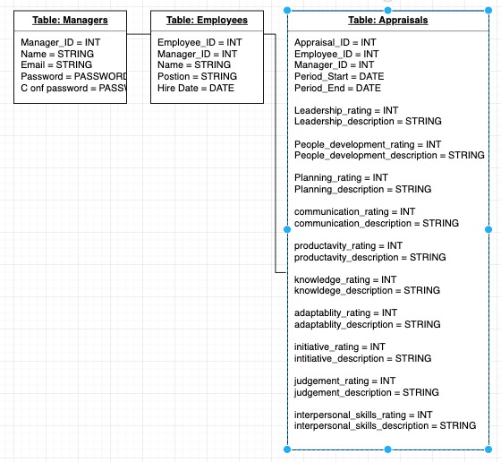

# AppPraise-Me
<h2>Project Description</h2>
    
AppPraise-Me aims to solve a tried and true issue seen in many workplaces. More often than not managers avoid completing empoyee appraisals in a timely manner because there is is not a quick and easy way for managers to repeat the appraisal process.  

<h2>User Story</h2>
    
Managers will securily log into the application and be redirected to their dashboards. On the dashboard the Manager will be able to see a list of all their employees as well as a component that would allow them to create a new employee. Managers can select an employee and view their profiles. On the Employee profile page the manager can update the employees information or even terminate the employee should the need arise. A list of appraisals as well as Key Perfromance Indicators will be visiable on the employee profile page. The manager can also elect to create a new appraisal for any of their employees. Appraisals cannot be deleted or updated so it is imperative that information collect on the appraisal is correct before being submitted.

<h2>Technologies Used</h2>
    <ul>
    <li>Rails (Backend)</li>
    <li>Ruby (Backend)</li>
    <li>Postgres SQL DB (Database)</li>
    <li>React(Frontend)</li>
    <li>Bcrypt</li>
    <li>Reactstrap</li>
    <li>Bootstrap</li>
    <li>React Router</li>
    <li>Heroku (Hosting)</li>
    </ul>
<h2>MVP/Post MVP</h2>
    <ul> MVP
    <li>A functional front end that translates backend information</li>
    <li>A Manager is able to create, read, update and delete employees.</li>
    </ul>
    <ul> Post MVP
     <li>A Manager is able to create, and read appraisals by employee and period.</li>
     <li>User authentication allows managers to create, read, and update their own profiles.</li>
     <li>User authentication allows multiple users to access the site and log in to view only updates they have made.</li>
    </ul>
<h2>Components</h2>
    <ul>
    <li>Navbar</li>
    <li>Login</li>
    <li>Register</li>
    <li>Employee Index</li>
    <li>Create Employee</li>
    <li>Read Employee</li>
    <li>Update Employee</li>
    <li>New Appraisal</li>
    <li>Read Appraisal</li>
    </ul>
<h2>Views</h2>
    <ul>
    <li>Login/Register</li>
    <li>Manager Dashboard</li>
    <li>Employee Show</li>
    <li>Appraisal Show</li>
    <li>New Appraisal</li>
    <li>Edit Employee</li>
    </ul>
<h2>Wireframes</h2>

<h2>ERD</h2>

<ul>  
    Tables
    <li>Users(Managers)</li>
    <li>Employees</li>
    <li>Appraisals<li>
</ul>
